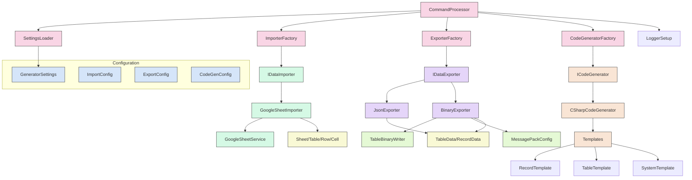
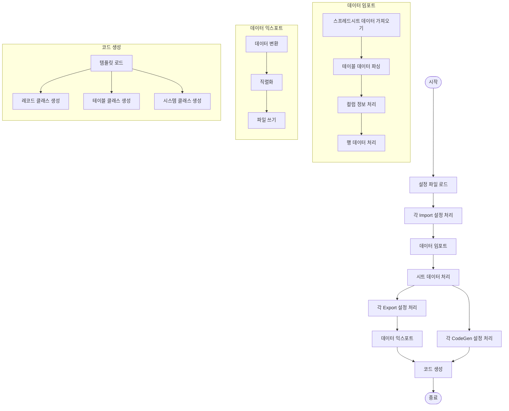
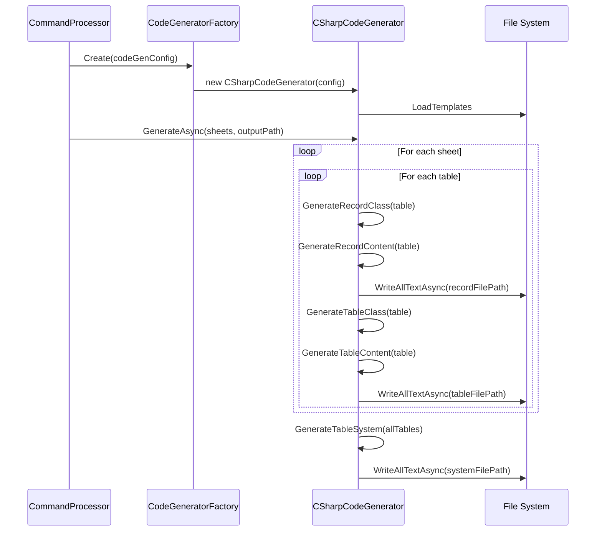
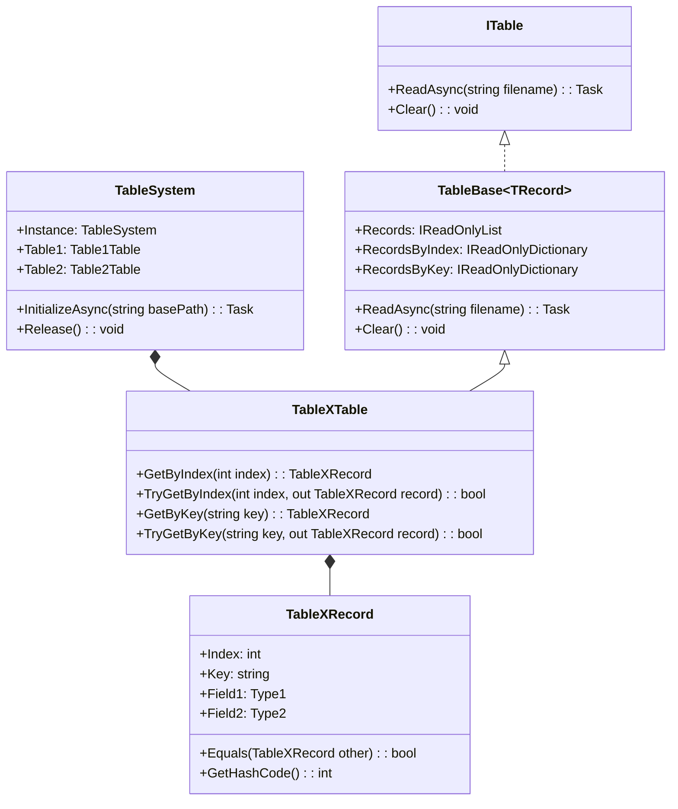
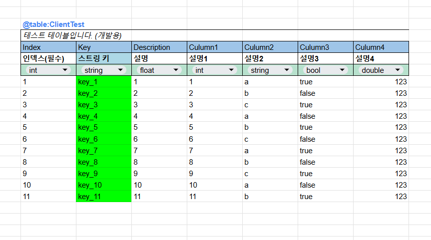

# SheetGenerator - 고급 데이터 및 코드 생성 도구

SheetGenerator는 구글 시트나 Excel 데이터를 바이너리 또는 JSON 형식으로 변환하고, 해당 데이터를 효율적으로 관리할 수 있는 C# 코드를 자동으로 생성하는 도구입니다.
c++, python등 다른 언어로의 생성 기능도 추가할 수 있도록 확장성을 고려해서 추상화하였습니다.

## 주요 기능

- 구글 시트에서 데이터 가져오기
- 바이너리/JSON 형식으로 데이터 내보내기
- 데이터 액세스를 위한 C# 코드 자동 생성
- MessagePack을 이용한 효율적인 바이너리 직렬화/역직렬화
- Index와 Key 기반 빠른 데이터 검색

## 시스템 아키텍처

다음 다이어그램은 SheetGenerator의 전체 아키텍처를 보여줍니다:



## 모듈 구조

SheetGenerator는 다음과 같은 주요 모듈로 구성되어 있습니다:

```mermaid
classDiagram
    %% 인터페이스
    class IDataImporter {
        +ImportAsync(GeneratorSettings) Task<List<Sheet>>
    }
    class IDataExporter {
        +ExportAsync(List<Sheet>, string) Task
    }
    class ICodeGenerator {
        +GenerateAsync(List<Sheet>, string) Task
    }
    
    %% 설정 클래스
    class GeneratorSettings {
        +List<ImportConfig> Imports
        +List<ExportConfig> Exports
        +List<CodeGenConfig> CodeGens
    }
    class ImportConfig {
        +string Type
    }
    class ExportConfig {
        +string Type
        +string OutputPath
    }
    class CodeGenConfig {
        +string Type
        +string FileLoadType
        +string Namespace
        +TemplateConfig Templates
        +string OutputPath
    }
    
    %% 구현 클래스
    class GoogleSheetImporter {
        +ImportAsync(GeneratorSettings) Task<List<Sheet>>
    }
    class JsonExporter {
        +ExportAsync(List<Sheet>, string) Task
    }
    class BinaryExporter {
        +ExportAsync(List<Sheet>, string) Task
    }
    class CSharpCodeGenerator {
        +GenerateAsync(List<Sheet>, string) Task
    }
    
    %% 팩토리 클래스
    class ImporterFactory {
        +Create(ImportConfig) IDataImporter
    }
    class ExporterFactory {
        +Create(ExportConfig) IDataExporter
    }
    class CodeGeneratorFactory {
        +Create(CodeGenConfig) ICodeGenerator
    }
    
    %% 모델 클래스
    class Sheet {
        +string Name
        +List<Table> Tables
    }
    class Table {
        +string Name
        +string Description
        +List<Column> Columns
        +List<Row> Rows
    }
    class Column {
        +string Name
        +string Type
        +string Description
        +int Index
    }
    class Row {
        +int Index
        +List<Cell> Cells
    }
    class Cell {
        +object Value
        +int ColumnIndex
    }
    
    %% IO 클래스
    class TableBinaryWriter {
        +WriteTable(Table)
    }
    class TableBinaryReader {
        +ReadMessagePackData<T>()
    }
    class TableJsonReader {
        +ReadJsonData<T>()
    }
    
    %% 관계 정의
    IDataImporter <|.. GoogleSheetImporter
    IDataExporter <|.. JsonExporter
    IDataExporter <|.. BinaryExporter
    ICodeGenerator <|.. CSharpCodeGenerator
    
    ImportConfig <|-- GoogleSheetImportConfig
    ExportConfig <|-- JsonExportConfig
    ExportConfig <|-- BinaryExportConfig
    CodeGenConfig <|-- CSharpCodeGenConfig
    
    GeneratorSettings *-- ImportConfig
    GeneratorSettings *-- ExportConfig
    GeneratorSettings *-- CodeGenConfig
    
    Sheet *-- Table
    Table *-- Column
    Table *-- Row
    Row *-- Cell
```



## 데이터 처리 흐름

SheetGenerator의 데이터 처리 흐름은 다음과 같습니다:



## 핵심 모듈 설명

### 1. 임포트 모듈

데이터 소스(구글 시트, Excel 등)에서 데이터를 가져오는 역할을 담당합니다.

- **IDataImporter**: 데이터 임포트를 위한 인터페이스
- **GoogleSheetImporter**: 구글 시트에서 데이터 가져오기 구현
- **GoogleSheetService**: 구글 시트 API와의 통신 처리

### 2. 익스포트 모듈

가져온 데이터를 다양한 형식(Binary, JSON)으로 변환하여 저장합니다.

- **IDataExporter**: 데이터 익스포트를 위한 인터페이스
- **JsonExporter**: JSON 형식으로 데이터 내보내기
- **BinaryExporter**: MessagePack을 이용한 바이너리 형식으로 데이터 내보내기

### 3. 코드 생성 모듈

데이터 접근을 위한 C# 코드를 자동으로 생성합니다.

- **ICodeGenerator**: 코드 생성을 위한 인터페이스
- **CSharpCodeGenerator**: C# 코드 생성 구현
- **Templates**: 코드 생성에 사용되는 템플릿 파일들 (Record, Table, System)

### 4. 설정 모듈

프로그램의 동작을 제어하는 설정을 관리합니다.

- **GeneratorSettings**: 전체 설정 구조
- **ImportConfig/ExportConfig/CodeGenConfig**: 임포트, 익스포트, 코드 생성에 대한 설정
- **SettingsLoader**: 설정 파일 로드 및 검증

### 5. 팩토리 패턴

다양한 임포터, 익스포터, 코드 생성기를 생성하는 팩토리 클래스들:

- **ImporterFactory**: 임포터 생성
- **ExporterFactory**: 익스포터 생성
- **CodeGeneratorFactory**: 코드 생성기 생성

### 6. 모델 클래스

데이터 구조를 표현하는 클래스들:

- **Sheet**: 시트 정보
- **Table**: 테이블 정보 및 컬럼/행 데이터
- **Column/Row/Cell**: 테이블의 구성 요소
- **TableData/RecordData**: 직렬화를 위한 데이터 구조

## 코드 생성 프로세스

SheetGenerator는 템플릿 기반으로 코드를 생성합니다. 다음은 코드 생성 프로세스입니다:



## 설계 패턴

SheetGenerator는 다음과 같은 설계 패턴을 활용합니다:

1. **팩토리 패턴**: `ImporterFactory`, `ExporterFactory`, `CodeGeneratorFactory`를 통해 다양한 구현체를 생성합니다.
2. **전략 패턴**: `IDataImporter`, `IDataExporter`, `ICodeGenerator` 인터페이스를 통해 다양한 전략을 구현합니다.
3. **템플릿 메서드 패턴**: 코드 생성 과정에서 템플릿을 활용하여 코드 구조를 정의합니다.
4. **싱글톤 패턴**: `PathHelper`, `LoggerSetup` 등에서 활용됩니다.
5. **컴포지트 패턴**: 데이터 모델 구조(Sheet, Table, Row, Cell)에서 사용됩니다.

## 생성된 코드 구조

SheetGenerator가 생성하는 C# 코드는 다음과 같은 구조를 가집니다:



## 의존성 패키지

```xml
<PackageReference Include="Google.Apis.Sheets.v4" Version="1.68.0.3624"/>
<PackageReference Include="MessagePack" Version="3.1.1"/>
<PackageReference Include="Microsoft.Extensions.Configuration" Version="9.0.0"/>
<PackageReference Include="Microsoft.Extensions.Configuration.Binder" Version="9.0.0"/>
<PackageReference Include="Microsoft.Extensions.Configuration.Json" Version="9.0.0"/>
<PackageReference Include="Serilog" Version="4.2.1-dev-02337"/>
<PackageReference Include="Serilog.Sinks.Console" Version="6.0.0"/>
<PackageReference Include="Serilog.Sinks.File" Version="6.0.0"/>
<PackageReference Include="System.CommandLine" Version="2.0.0-beta4.22272.1"/>
```

## 사용법

1. Google Cloud Platform에서 서비스 계정 생성
2. 구글 시트 API 활성화
3. 구성 파일 설정 (settings.json)
```json
{
  "imports": [
    {
      "type": "GoogleSheet",
      "spreadsheetId": "YOUR_SPREADSHEET_ID",
      "auth": {
        "authType": "ServiceAccount",
        "serviceAccountPath": "credentials/service_account.json"
      }
    }
  ],
  "exports": [
    {
      "type": "Binary",
      "outputPath": "Generated/Data",
      "extension": "table"
    }
  ],
  "codeGens": [
    {
      "type": "CSharp",
      "fileLoadType": "binary",
      "namespace": "YourNamespace.Tables",
      "outputPath": "Generated/Script/CSharp",
      "templates": {
        "recordPath": "ScriptTemplate/CSharp/RecordTemplate.txt",
        "tablePath": "ScriptTemplate/CSharp/TableTemplate.txt",
        "systemPath": "ScriptTemplate/CSharp/SystemTemplate.txt"
      }
    }
  ]
}
```
4. 구글 시트 포맷 설정
테이블은 다음과 같은 형식으로 구성됩니다:

- 첫 줄: `@table:[테이블명]` 형식으로 테이블 시작을 표시
- 두 번째 줄: 테이블 설명
- 세 번째 줄: 컬럼명
- 네 번째 줄: 데이터 타입 (int, string, float, bool, double 등)
- 다섯 번째 줄: 컬럼 설명
- 이후: 실제 데이터
예시 스프레드시트의 구조:
```
@table:ClientTest
테스트 테이블입니다 (개발용)
Index    Key      Description   Column1    Column2    Column3    Column4
int      string   float        int        string     bool       double
인덱스(필수)  스트링 키  설명        설명1      설명2      설명3      설명4
1        key_1    1           1          a          true       123
2        key_2    2           2          b          false      123
...
```
5. 실행
```bash
SheetGenerator --config path/to/settings.json
```
6. 초기화
```bash
SheetGenerator --init
```

## 생성된 코드 사용 예시

```csharp
// 테이블 시스템 초기화
await TableSystem.Instance.InitializeAsync("path/to/data");

// Index로 데이터 접근
var record = TableSystem.Instance.YourTable.GetByIndex(1);

// Key로 데이터 접근
var record = TableSystem.Instance.YourTable.GetByKey("unique_key");

// 모든 레코드 순회
foreach (var record in TableSystem.Instance.YourTable.Records)
{
    // 레코드 처리
}
```

## 프로젝트 구조

```
SheetGenerator/
├── Configuration/           # 설정 관련 클래스들
│   ├── GeneratorSettings.cs  # 전체 설정 구조
│   ├── SettingsLoader.cs     # 설정 로드 및 검증
│   ├── CodeGenConfig.cs      # 코드 생성 설정
│   ├── ImportConfig.cs       # 임포트 설정
│   └── ExportConfig.cs       # 익스포트 설정
│
├── Import/                  # 데이터 임포트 모듈
│   ├── IDataImporter.cs      # 임포터 인터페이스
│   ├── GoogleSheetImporter.cs # 구글 시트 임포터
│   └── GoogleSheetService.cs # 구글 시트 API 서비스
│
├── Export/                  # 데이터 익스포트 모듈
│   ├── IDataExporter.cs      # 익스포터 인터페이스
│   ├── JsonExporter.cs       # JSON 익스포터
│   └── BinaryExporter.cs     # 바이너리 익스포터
│
├── CodeGenerate/            # 코드 생성 모듈
│   ├── ICodeGenerator.cs     # 코드 생성기 인터페이스
│   └── CSharpCodeGenerator.cs # C# 코드 생성기
│
├── Factory/                 # 팩토리 클래스들
│   ├── ImporterFactory.cs    # 임포터 팩토리
│   ├── ExporterFactory.cs    # 익스포터 팩토리
│   └── CodeGeneratorFactory.cs # 코드 생성기 팩토리
│
├── Models/                  # 데이터 모델
│   ├── Sheet.cs              # 시트 모델
│   ├── Table.cs              # 테이블 모델
│   ├── TableData.cs          # 직렬화용 테이블 데이터
│   └── RecordData.cs         # 직렬화용 레코드 데이터
│
├── IO/                      # 입출력 관련
│   ├── TableBinaryWriter.cs  # 바이너리 파일 쓰기
│   ├── TableBinaryReader.cs  # 바이너리 파일 읽기
│   └── TableJsonReader.cs    # JSON 파일 읽기
│
├── MessagePack/             # MessagePack 관련
│   ├── MessagePackConfig.cs  # MessagePack 설정
│   └── DynamicObjectFormatter.cs # 동적 객체 포맷터
│
├── Util/                    # 유틸리티
│   ├── PathHelper.cs         # 경로 관련 유틸
│   ├── StringExtensions.cs   # 문자열 확장 메서드
│   └── StringFormatter.cs    # 문자열 포맷팅
│
├── Logging/                 # 로깅
│   └── LoggerSetup.cs        # 로거 설정
│
├── Commands/                # 명령행 처리
│   └── SheetGeneratorCommand.cs # 명령행 명령 처리
│
├── Program.cs               # 프로그램 진입점
├── CommandProcessor.cs      # 명령 처리 로직
└── EnvironmentInitializer.cs # 환경 초기화
```

## 옵션

```bash
Options:
  --config <path>     설정 파일 경로
  --loglevel <level>  로그 레벨 (Verbose, Debug, Information, Warning, Error)
  --init             초기화 모드 실행
  --force            기존 파일 덮어쓰기
  --development      개발 모드로 실행
```

## 향후 개선 사항

- Excel 파일 직접 임포트 기능 개선
- 추가 프로그래밍 언어 지원 (C++, TypeScript 등)
- CLI 인터페이스 개선
- 웹 기반 관리 도구 추가
- 증분 업데이트 지원
- 데이터 변환 및 검증 기능 확장

## License

MIT License
